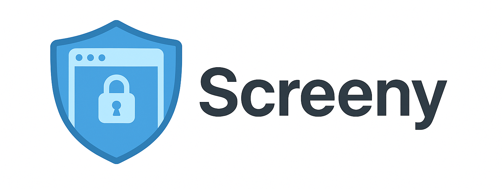

[](https://pypi.org/project/mcp-server-screeny/)
[](https://pepy.tech/projects/mcp-server-screeny)
[](https://www.apple.com/macos/)
[](https://opensource.org/licenses/MIT)

[](https://cursor.com/install-mcp?name=screeny&config=eyJjb21tYW5kIjoidXZ4IG1jcC1zZXJ2ZXItc2NyZWVueSJ9)

# Screeny MCP Server: Privacy first macOS Screenshots for AI Agents

A **privacy-first, macOS-only MCP server** that enables AI agents to capture screenshots of pre-approved application windows, providing secure visual context for development and debugging tasks.

> [!IMPORTANT]
> Requires **Screen Capture permission** + **Window Approval Setup** - see instructions below.

## 🔒 Privacy-First Design

Unlike other screenshot tools, Screeny requires **explicit user approval** for each window before it can be captured:

- **Window approval system** - Only pre-approved windows can be captured (approved during setup)
- **User-controlled access** - You decide exactly which windows are accessible
- **Non-intrusive capture** - Screenshots taken in background without changing window focus or interrupting your workflow
- **No external connections** - Screeny runs entirely on your device, screenshots are deleted immediately after use

## Available Tools

- `listWindows` - Lists all approved application windows available for screenshot capture.

  - Only shows user approved windows

- `takeScreenshot` - Captures a screenshot of a specific window by its ID.
  - **Captures windows in background** - no need to bring window to front, but cannot capture minimized windows
  - **Provides actual pixel data** - full-fidelity image, not OCR or text extraction
  - **Can compress image** - if needed, compresses large images to fit within 1MB

### Resources

- `screeny://info` - Server information and configuration details

## Configuration

### Claude Desktop

1. Open Claude settings → Developer → Edit Config
2. Add configuration
3. **Restart Claude Desktop** after saving config

<details>
<summary><strong>Using pipx</strong></summary>

First install with: `pipx install mcp-server-screeny`

```json
{
  "mcpServers": {
    "screeny": {
      "command": "mcp-server-screeny",
      "args": []
    }
  }
}
```

> **Note:** If you get an `ENOENT` error, replace `"mcp-server-screeny"` with the full path to the executable (find it with `which mcp-server-screeny` in your terminal).

</details>

<details>
<summary><strong>Using uvx</strong></summary>

```json
{
  "mcpServers": {
    "screeny": {
      "command": "uvx",
      "args": ["mcp-server-screeny"]
    }
  }
}
```

> **Note:** If you get a "spawn uvx ENOENT" error, replace `"uvx"` with the full path to uvx:
>
> ```bash
> which uvx  # Find your uvx path
> ```
>
> Then use that full path in the config (e.g., `"/opt/homebrew/bin/uvx"`).

</details>

### Cursor

1. Open Cursor settings → Tools & Integrations → MCP Tools
2. Add configuration
3. **Restart Cursor** after saving config

<details>
<summary><strong>Using pipx</strong></summary>

First install with: `pipx install mcp-server-screeny`

```json
{
  "mcpServers": {
    "screeny": {
      "command": "mcp-server-screeny",
      "args": []
    }
  }
}
```

> **Note:** If you get an `ENOENT` error, replace `"mcp-server-screeny"` with the full path to the executable (find it with `which mcp-server-screeny` in your terminal).

</details>

<details>
<summary><strong>Using uvx</strong></summary>

```json
{
  "mcpServers": {
    "screeny": {
      "command": "uvx",
      "args": ["mcp-server-screeny"]
    }
  }
}
```

> **Note:** If you get a "spawn uvx ENOENT" error, replace `"uvx"` with the full path to uvx:
>
> ```bash
> which uvx  # Find your uvx path
> ```
>
> Then use that full path in the config (e.g., `"/opt/homebrew/bin/uvx"`).

</details>

## Setup

### 1. Grant Screen Capture Permission (Required)

**Important:** Grant permission before running window approval.

> **Note**: You need to grant Screen Capture permission to BOTH:
>
> 1. **Your Terminal application** (Terminal.app, iTerm2, etc.) - Required for running setup (can be disabled after)
> 2. **Your MCP host** (Claude Desktop, Cursor) - Required for taking screenshots
>
> To add them:
>
> 1. Open **System Settings** > **Privacy & Security** > **Screen & System Audio Recording**
> 2. Click the **"+"** button
> 3. Add your Terminal application AND your MCP host application
> 4. **Restart both applications** after granting permissions

### 2. Window Approval (Required)

After configuring your MCP client above, approve which windows can be captured.

<details>
<summary><strong>If using pipx</strong></summary>

```bash
# Interactive approval
mcp-server-screeny --setup

# Auto-approve all current windows
mcp-server-screeny --setup --allow-all
```

</details>

<details>
<summary><strong>If using uvx</strong></summary>

```bash
# Interactive approval
uvx mcp-server-screeny --setup

# Auto-approve all current windows
uvx mcp-server-screeny --setup --allow-all
```

</details>

Approvals are saved to `~/.screeny/approved_windows.json`. Re-run setup when you want to update the list of approved windows.

## Security & Privacy

- Only user-approved windows can be captured
- All processing stays local on your machine
- Screenshots are temporary and deleted immediately after use

## Troubleshooting

### Permission Issues

```bash
# Test window detection and permissions
mcp-server-screeny --debug

# Re-run setup if windows changed
mcp-server-screeny --setup
```

### Common Issues

**"spawn uvx ENOENT" error**

- Solution: Use the full path to uvx in your MCP config instead of just `"uvx"`
- Find path with: `which uvx`
- Example: `"/opt/homebrew/bin/uvx"` or `"/usr/local/bin/uvx"`

**"No approved windows found"**

- Solution: Run `mcp-server-screeny --setup` first (or `uvx mcp-server-screeny --setup` if using uvx)

**"Screen Recording permission required" or "No windows found"**

- Solution: Grant Screen Recording permission in System Settings > Privacy & Security > Screen & System Audio Recording
  - Click "+" button and manually add your MCP host (Claude Desktop, Cursor, etc.)
  - Restart your MCP host application after granting permissions
- Try running setup again after granting permissions

## Contributing

Pull requests are welcome! Feel free to contribute new ideas, bug fixes, or enhancements.

This is my first MCP project - if you encounter any bugs, please open an issue and I'll do my best to fix them!

<details>
<summary><strong>Why I Built This</strong></summary>

I created this tool to streamline my mobile development workflow. I was tired of
manually taking screenshots repeatedly to describe UI issues. With Screeny, Cursor can directly capture screenshots of my iOS simulator and iterate on the design in a loop. I'm excited to see how others will use this!

</details>

## Requirements

- Python 3.10+
- macOS
- Screen Capture permission

## License

MIT License
